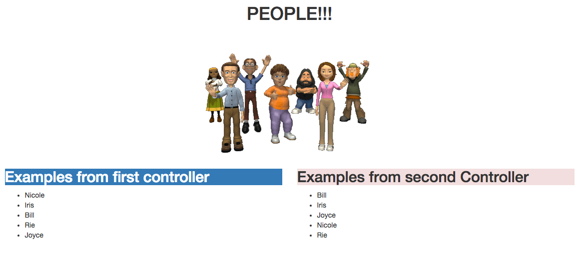

# BUILDING FACTORIES — LAB

-Utilizing Glenn’s API at http://glenndama.herokuapp.com/api/people create a factory using `$http` that performs a `GET` request.

-Create TWO controllers that each make their own separate API calls using the factory

-Use ng-repeat to iterate over the people objects that are returned from the API

-Use an `orderBy` filter to differentiate between the two lists.

## EXAMPLE

------

#### TIPS

-A successful response from the API will return 100 people objects

-You can limit the amount of people returned by adding a query parameter, e.g., `http://glenndama.herokuapp.com/api/people?limit=5`